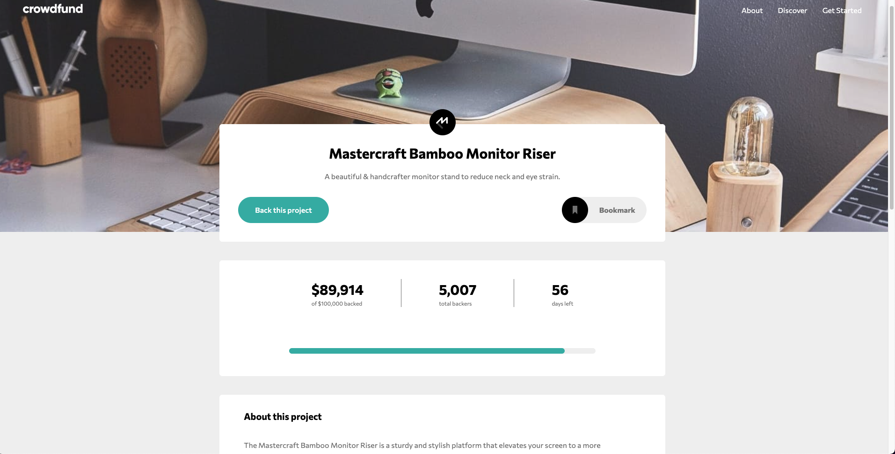

# Frontend Mentor - Crowdfunding product page solution

This is a solution to the [Crowdfunding product page challenge on Frontend Mentor](https://www.frontendmentor.io/challenges/crowdfunding-product-page-7uvcZe7ZR). Frontend Mentor challenges help you improve your coding skills by building realistic projects.

## Table of contents

- [Overview](#overview)
  - [The challenge](#the-challenge)
  - [Screenshot](#screenshot)
  - [Links](#links)
- [My process](#my-process)
  - [Built with](#built-with)
  - [Continued development](#continued-development)
  - [Useful resources](#useful-resources)
- [Author](#author)

## Overview

### The challenge

Users should be able to:

- View the optimal layout depending on their device's screen size
- See hover states for interactive elements
- Make a selection of which pledge to make
- See an updated progress bar and total money raised based on their pledge total after confirming a pledge
- See the number of total backers increment by one after confirming a pledge
- Toggle whether or not the product is bookmarked

### Screenshot

### Links

- Solution URL: [Add solution URL here](https://your-solution-url.com)
- Live Site URL: [Add live site URL here](https://your-live-site-url.com)

## My process

### Built with

- Tailwind CSS
- Flexbox
- Webpack
- [React](https://reactjs.org/) - JS library

### Continued development

I have struggled with the responsive design of this project, so I would like to keep researching about it.

### Useful resources

- [Separating responsibilities in your code](https://sairys.medium.com/react-separating-responsibilities-using-hooks-b9c90dbb3ab9) - This article was very useful to start structuring my project. Even thoug it is a very small in size project, deciding a proper component structure felt overwhelming when I started this challenge. It also offers you tips on how to make further research on the topic.

## Author

- Linkedin - [Nia Robles](linkedin.com/in/nia-robles-205061249)
- GitHub - [niaveser](https://github.com/niaveser)
- Frontend Mentor - [@niaveser](https://www.frontendmentor.io/profile/niaveser)
